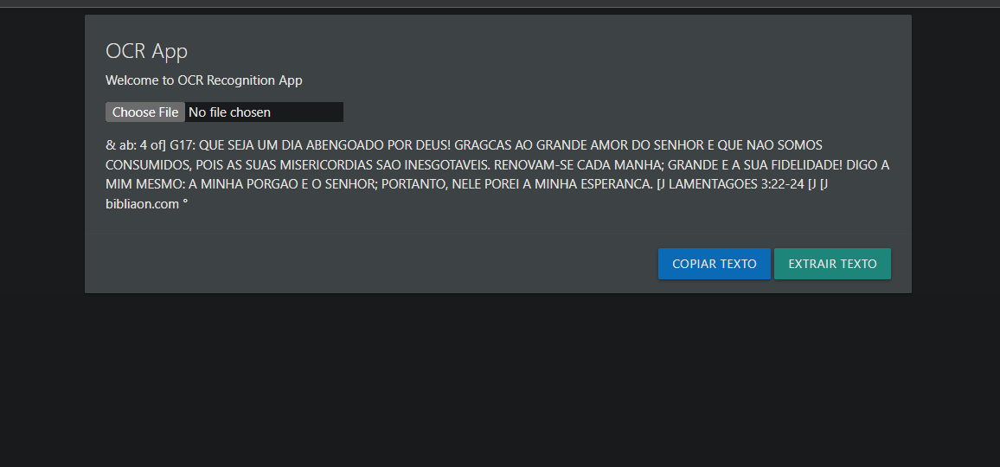

<!-- Intro-->

<!--
* Thanks for reviewing my ocr-app! 
* Access the blank-template here (https://github.com/idarciooliveira/ocr-app/blob/main/Templates/_blank-README.md) 
* 
* Read the comments for an easy step by step guide.or read this Make_it_Yours guide here: () // add Personalization_md_file
* Enjoy!
-->


<!-- Shields Section--><!-- Optional -->

<!-- 
* Insert project shields and badges through this link https://shields.io/
* 
*
-->

<div align="center">
    <a href="https://github.com/idarciooliveira/ocr-app/blob/main/LICENSE.txt"></a>
    <a href="https://github.com/idarciooliveira/ocr-app/stargazers"></a>
    <a href="https://github.com/idarciooliveira/ocr-app/issues"></a>
    <a href="https://github.com/idarciooliveira/ocr-app/network"></a>
</div>
<br>


<!-- Logo Section  --><!-- Required -->

<!--
* Insert an image URL in the  "src" attribute bellow. (line )
* 
* Insert your github profile URL in the <a> "href" attribute bellow (line )
-->


<div align="center">
    <a href="https://github.com/idarciooliveira" target="_blank">
        
    </a>
</div>


<!-- Project title 
* use a dynamic typing-SvG here https://readme-typing-svg.demolab.com/demo/
*
*  Instead you can type your project name after a # header
-->

<div align="center">

</div>


## About<!-- Required -->
<!-- 
* information about the project 
* 
* keep it short and sweet
-->


This is a simples  Optical Character Recognition (OCR) that you can upload a image and get all extracted from that image. follow the [How to use guide](#how-to-use-this-project).


## How to use this project<!-- Required -->
<!-- 
* Here you may add information about how 
* 
* and why to use this project.
-->

- clone this repository into your local machine.

```bash
    git clone https://github.com/idarciooliveira/ocr-app.git
```

<!-- ## DemoRequired -->
<!-- 
* You can add a demo here GH supports images/ GIFs/videos 
* 
* It's recommended to use GIFs as they are more dynamic
-->


<div align="center">
    
</div>

<!-- ## Table of ContentsOptional -->
<!-- 
* This section is optional, yet having a contents table 
* helps keeping your README readable and more professional.
* 
* If you are not familiar with HTML, no worries we all been there :) 
* Review learning resources to create anchor links. 
-->


<!-- <dev display="inline-table" vertical-align="middle">
<table align="center" vertical-align="middle">
        <tr>
            <td><a href="#about">About</a></td>        
            <td><a href="#how-to-use-this-project">Getting started</td>
            <td><a href="#demo">Demo</a></td>
            <td><a href="#project-roadmap--">Project Roadmap</a></td>
            <td><a href="#documentation">Documentation</a></td>
            <td><a href="#contributors">Contributors</a></td>
        </tr>
        <tr>
            <td><a href="#acknowledgments">Acknowledgments</a></td>
            <td><a href="https://github.com/idarciooliveira/ocr-app/tree/main/Learning_Resources">Learning Resources</a></td>
            <td><a href="https://github.com/idarciooliveira/ocr-app/wiki/Step-by-Step-Guide">
            Step By Step Guide</a></td>
            <td><a href="#feedback">Feedback</a></td>
            <td><a href="#contact">Contact</a></td>
            <td><a href="#license">License</a></td>
        </tr>
</table>
</dev> -->


<!-- - Use this html element to create a back to top button. -->
<p align="right"><a href="#how-to-use-this-project">back to top ⬆️</a></p>


## License<!-- Optional -->
<!-- 
* Here you can add project license for copyrights and distribution 
* 
* check this website for an easy reference https://choosealicense.com/)
-->

- [MIT License](./LICENSE.txt)


<!-- - Use this html element to create a back to top button. -->
<p align="right"><a href="#how-to-use-this-project">back to top ⬆️</a></p>